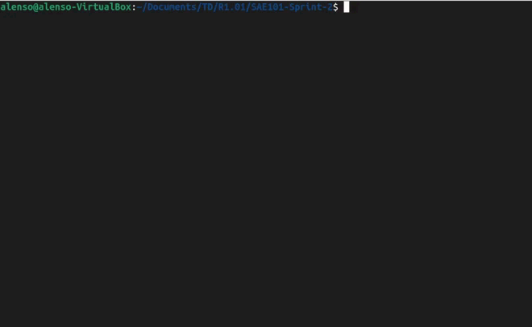
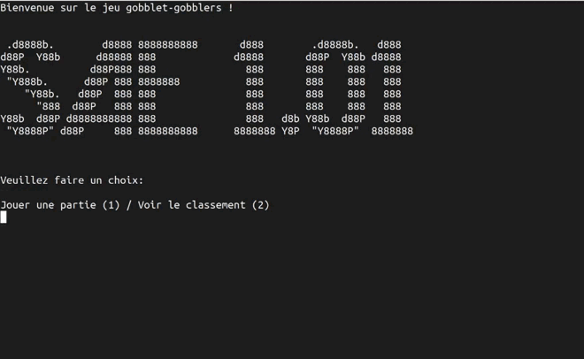
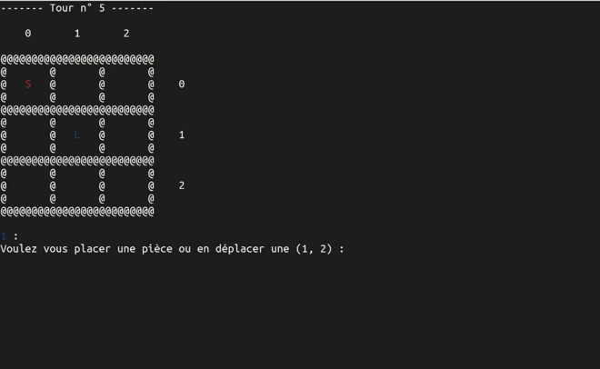
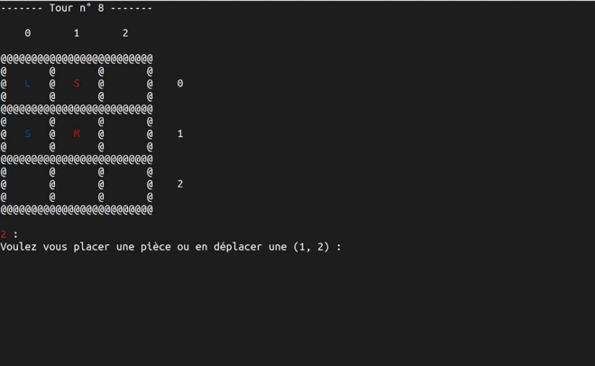
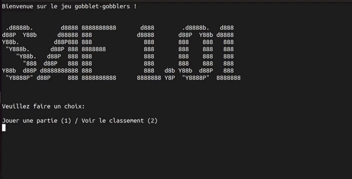
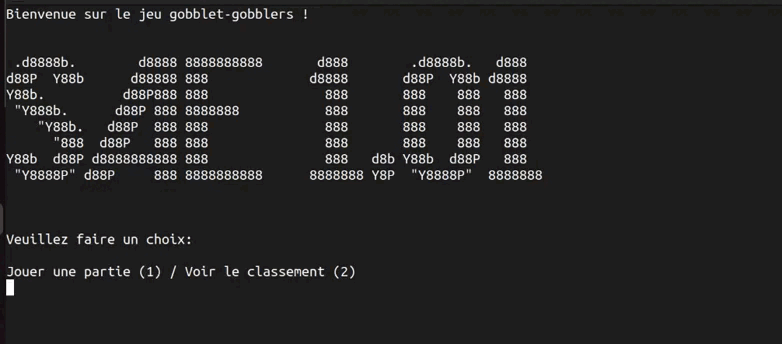

# Gobblets-Gobblers
Ce projet _Gobblets-Gobblers_ a été réalisé par Alenso Lopes et Julien Sailly dans le cadre d'étude en BUT Informatique.

Codé grâce au language de programmation C, il permet de jouer à ce jeu de société dans le terminal linux.

Ce projet inclut un classement entre les différents joueur, une option de sauvegarde automatique lors d'une partie non terminée avec possibilité de la reprendre.

## Mode d'emploi

  1) Compiler le programme en incluant le fichier main.c ainsi que le board.c.
  `gcc -Wall main.c board.c -o gobblers`
  2) Lancer le programme.
  `./gobblers`

  

  4) Une fois le programme lancé, il vous est possible d'accéder au jeu et à son classement.
  5) Une fois dans le jeu, chaque joueur doit choisir un pseudonyme.
  6) Ensuite, les étapes de lancement sont prêtes. Il vous est donc possible de jouer.
  7) Pour jouer, vous devez déterminer si vous voulez placer une pièce ou en déplacer une.
 
  8) En cas de déplacement, si vous n'avez pas de pièce il ne sera pas possible d'en déplacer une.

  9) En cas de placement d'une pièce, vous devez sélectionner la pièce à placer ainsi que saisir ses coordonnées (0,2).
  10) C'est un jeu en tour par tour, il sera donc au second joueur de jouer.

  11) Si vous quittez la partie lorsqu'elle est en cours, et si vous relancez le programme vous pourrez au choix : recommencer une partie ou continuer celle non terminée.
  
    
  12) Une fois la partie terminée, vous pouvez accéder au classement avec des points selon les victoires et les défaites. (+10/-8).
  

## Système de stockage des données du leaderboard

  1) Le premier chiffre dans le fichier classement.txt correspond au nombre de joueur inscrit dans le classement.
  2) La première information de chaque colonne correspond au nom du joueur
  3) La Deuxième information de chaque colonne correspond au nombre de point du joueur.
```
2
Alenso 10
Julien -8
```

## Système de stockage des données du système de sauvegarde

  1) La premières information correspond aux tailles des pièces présentes sur le plateau. Chaque ligne est séparée par des `|` et chaque cases par des `;`.
  2) La seconde information correspond aux propriétaires de chaque pièce sur le plateau. Les lignes sont séparées par des `|` et les cases par des `;`.
  3) La troisième information correspond au tour du joueur en cours.
  4) La dernière information correspond au nombre de pièces disponible dans les maison pour chaque joueur. Les joueurs sont séparées par des `|`.

Au début du jeu, on a :
```
sizes: 0,0,0,0,;0,0,0,0,;0,0,0,0,;|0,0,0,0,;0,0,0,0,;0,0,0,0,;|0,0,0,0,;0,0,0,0,;0,0,0,0,;|
players: 0,0,0,0,;0,0,0,0,;0,0,0,0,;|0,0,0,0,;0,0,0,0,;0,0,0,0,;|0,0,0,0,;0,0,0,0,;0,0,0,0,;|
turn_player: 1,
houses: 2,2,2,|2,2,2,|�
```

## Extensions sélectionnées

### Sauvegarde

L'extension de sauvegarde permet d'enregistrer une partie dans un fichier `save.txt`. Cette sauvegarde se déroule automatiquement à la fin de chaque tours et enregistre l'état du plateau, le joueur devant jouer ainsi que les pièces appartenants aux joueurs.

### Classement

Cette extension a pour but d'enregistrer dans un fichier les noms des différents joueurs ayant lancé une partie, ainsi que leurs scores respectifs. 

Au lancement du jeu, il est possible de visualiser ce classement trié dans l'ordre décroissant en fonction du score. 

Pour finir, le joueur gagnant voit son score augmenter de +10 points et le joueur perdant perd 8 points. 